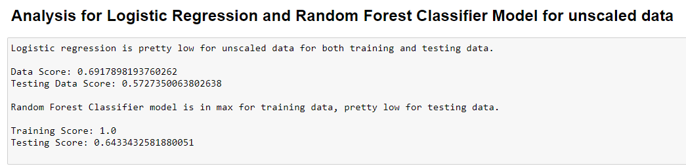
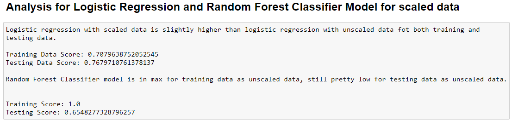
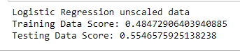
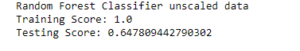
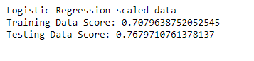
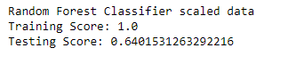

# Supervised Machine Learning - Predicting Credit Risk

In this assignment, I built a machine learning model that attempts to predict whether a loan from LendingClub is high risk or not. 

## Background

LendingClub is a peer-to-peer lending services company that allows individual investors to partially fund personal loans as well as buy and sell notes backing the loans on a secondary market. LendingClub offers their previous data through an API.

I used this data to create machine learning models to classify the risk level of given loans. Specifically, I compared the Logistic Regression model and Random Forest Classifier.

### Data

In the `Generator` folder in `Resources`, there is a [GenerateData.ipynb](/Resources/Generator/GenerateData.ipynb) notebook that downloaded data from LendingClub and output two CSVs: 

* `2019loans.csv`
* `2020Q1loans.csv`

I used an entire year's worth of data (2019) to predict the credit risk of loans from the first quarter of the next year (2020).

X=features
y=label 

## Preprocessing: Convert categorical data to numeric

Created a training set from the 2019 loans using `pd.get_dummies()` to convert the categorical data to numeric columns. Similarly, created a testing set from the 2020 loans, also using `pd.get_dummies()`. There was a missing column in testing data which was inserted into the testing data "debt_settlement_flag_Y" 

## Consider the models

I created and compared two models on this data: a logistic regression, and a random forests classifier. Before I created, fit, and scored the models, made a prediction as Logistic Regression would perform better for this data. 

## Fit a LogisticRegression model and RandomForestClassifier model

Created a LogisticRegression model, fit it to the data, and printed the model's score, did the same for a RandomForestClassifier. I added missiig column "debt_settlement_flag_Y" , so score can be seen as below for both scaled and unscaled data by using LR and RFC models. 

## Revisit the Preprocessing: Scale the data

Used `StandardScaler` to scale the training and testing sets. 

Fit and score the LogisticRegression and RandomForestClassifier models on the scaled data. 

## Drop the column "debt_settlement_flag_Y" from training data which was not in the testing data

I also run the models dropping the missing columns from training data, the scores look very similar for both LR and RFC models for both unscaled and scaled data. So there is no impact of column "debt_settlement_flag_Y" to our data. You can see result of score as above in the code.

As a result, I would go Logistic Regression with scaled data model for prediction as it seems more accurate for both training and testing data.   With the scaled data, there is %15 increase of testing data score which makes our data more closer to the max.